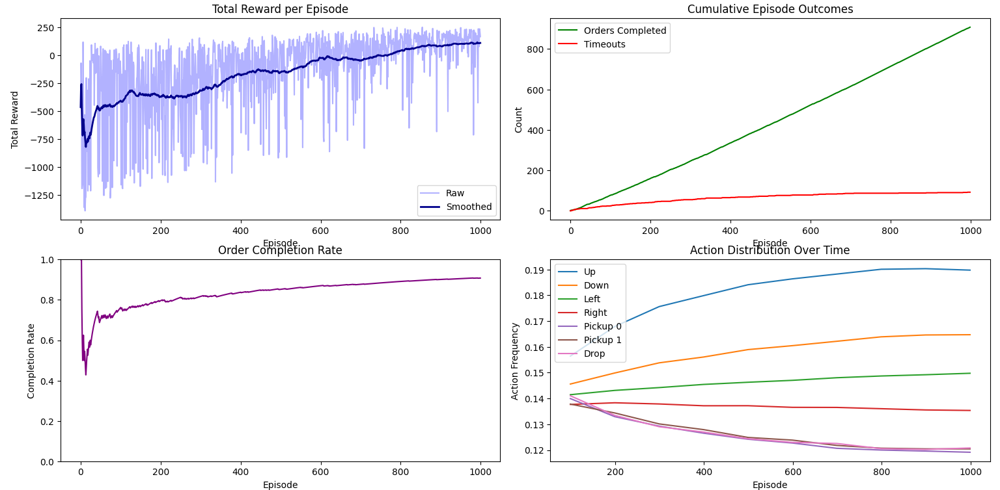
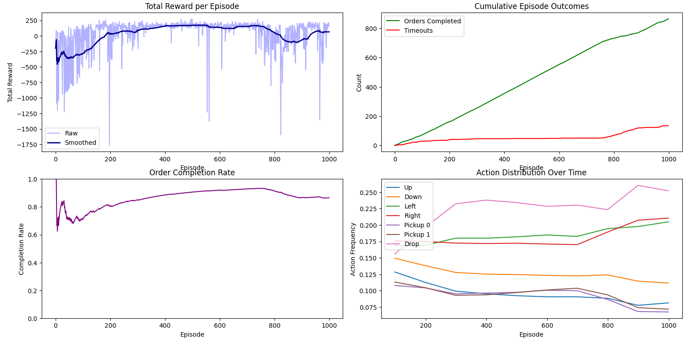

# Warehouse Reinforcement Learning

## Overview
This project implements reinforcement learning algorithms to optimize warehouse operations through intelligent agent-based decision making. The simulation environment models a warehouse where agents must navigate, pick up items, and deliver them efficiently while avoiding obstacles and minimizing time/energy costs.

## Project Description
Warehouse automation presents significant challenges in resource allocation, path planning, and dynamic decision making. This project explores how reinforcement learning can address these challenges by training agents that learn optimal policies through interaction with a simulated environment. 
The warehouse is modeled as a grid-based environment with fixed shelf positions, dynamic item requests, and spatial constraints like walls and containers. The agent observes the warehouse through a multi-channel matrix (position, shelf layout, inventory levels) and chooses from a discrete action space including movement, item pickup, and item drop-off.

The implemented agents use both traditional tabular methods (Q-learning) and neural network approximators (Deep Q-Network) to learn effective warehouse navigation strategies. The environment simulates real-world warehouse constraints including:
- Physical layout with aisles, storage locations, and obstacles
- Time and energy costs for movement and actions
- Dynamic inventory placement and retrieval tasks

By comparing different reinforcement learning approaches, this project demonstrates the advantages and limitations of each method in warehouse optimization contexts, providing insights for potential real-world applications.

## Features

- Custom warehouse environment built on the Gymnasium framework
- Configurable environment parameters (size, obstacle density, reward structure)
- Q-learning agent with tabular state representation
- Deep Q-Network (DQN) agent with experience replay and target networks
- Double DQN implementation to reduce value overestimation
- Episode tracking, reward curves, and performance visualization tools
- Manual control mode for environment testing and baseline comparison

## Future Work

- Implementation of additional reinforcement learning algorithms (PPO, A3C)
- Multi-agent coordination for collaborative warehouse tasks
- Integration with more complex warehouse simulations
- Real-time visualization of agent learning and performance

## Results

Example results are QLearning and DoubleDQLearning agents trained on 5x5 grid warehouse with two types of items. The result graphs are shown below: 

QLearning Agent


DoubleDQLearning


QLearning agent performs well in small and simple environments and encounters difficulties in larger warehouses.
DoubleDQLearning agent is more suitable for larger environments and slower epsilon decay.

## Installation

```bash
# Clone the repository
git clone https://github.com/Nikodem5/warehouse
cd warehouse-reinforcement-learning

# Create and activate virtual environment
python -m venv venv
source venv/bin/activate

# Install dependencies
pip install -r requirements.txt
```

## Usage

### Q-Learning Agent
Run the tabular Q-learning implementation:
```bash
python q_learning_run.py
```

### Double DQN Agent
Run the neural network-based Double DQN implementation:
```bash
python doubledqn_run.py
```

### Manual Control
Test the environment manually:
```bash
python environment/manual_control.py
```